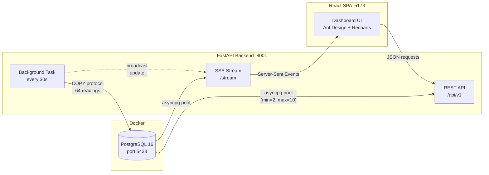
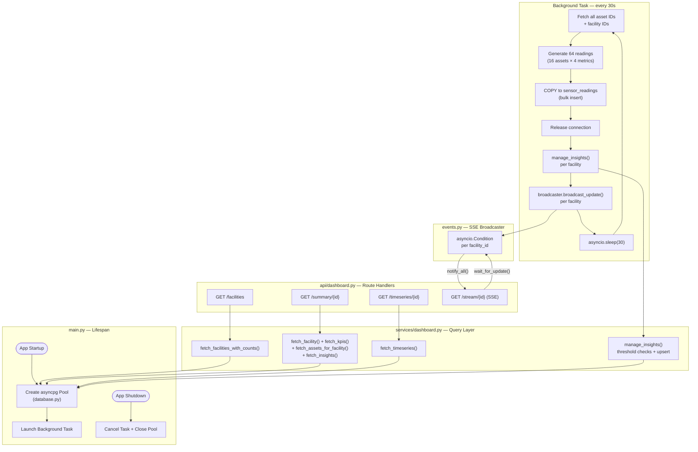
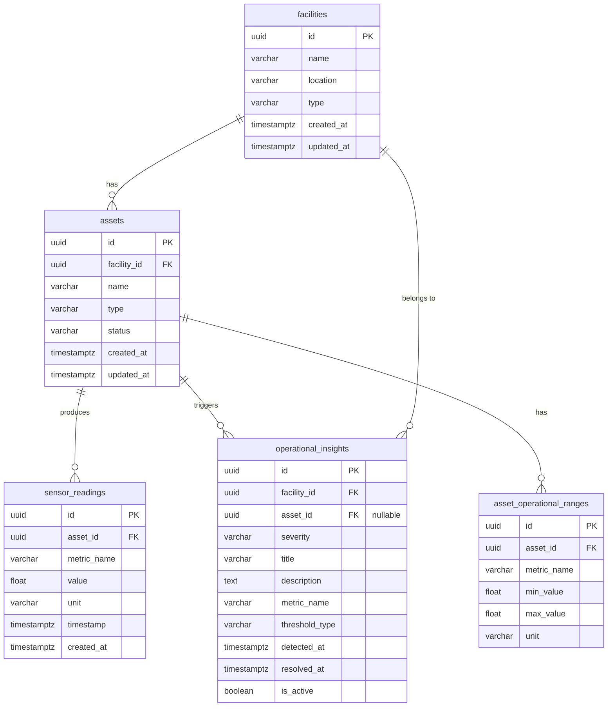

# 🏭 Plant Monitor Dashboard

Real-time industrial monitoring dashboard that tracks equipment health across multiple facilities. Operators can observe live sensor data — **temperature**, **pressure**, **power consumption**, and **production output** — for every asset in the plant, with automatic KPI aggregation, interactive time-series charting, and operational insights.


---

## Table of Contents

- [Features](#features)
- [Tech Stack](#tech-stack)
- [Architecture](#architecture)
- [Project Structure](#project-structure)
- [Prerequisites](#prerequisites)
- [Getting Started](#getting-started)
  - [1. Start PostgreSQL](#1-start-postgresql)
  - [2. Backend](#2-backend)
  - [3. Frontend](#3-frontend)
- [API Reference](#api-reference)
- [Database Schema](#database-schema)
- [Data Generation](#data-generation)
- [Design Decisions](#design-decisions)
- [License](#license)

---

## Features

| Feature | Description |
|---------|-------------|
| **Multi-Facility Support** | Switch between facilities (Power Station, Chemical Plant, Manufacturing) via a global selector |
| **Real-Time KPI Cards** | Aggregated avg/min/max/current for temperature, pressure, power, and production output |
| **Operational Insights** | Automatic alerts when sensor readings exceed per-asset operational ranges, with severity levels (low/medium/high) |
| **Assets Overview** | Operational vs. maintenance count badges + detailed asset status table with live metric values and threshold ranges |
| **Interactive Time-Series Chart** | Select metric, time window (12h / 24h / 48h), and bucket size; multi-asset line chart (Recharts) |
| **Server-Sent Events (SSE)** | Real-time push updates — no polling needed; dashboard refreshes automatically when new readings arrive |
| **Live Data Generation** | Background task inserts 64 readings (16 assets × 4 metrics) every 30 seconds via `COPY` protocol |
| **Seed Data** | One-command seeding of ~368k realistic sensor readings spanning 48 hours |
| **Swagger / OpenAPI Docs** | Auto-generated at `/docs` — fully typed request/response schemas |

---

## Tech Stack

| Layer | Technology | Purpose |
|-------|-----------|---------|
| **Frontend** | React 19 + TypeScript | SPA framework |
| **UI Library** | Ant Design 6 | Layout, cards, tables, selectors |
| **Charting** | Recharts 3 | Time-series `LineChart` with tooltips |
| **State** | React Context + hooks | Facility selection, data fetching |
| **HTTP Client** | Axios | API consumption with proxy |
| **Backend** | FastAPI (Python) | Async REST API + SSE streaming |
| **Validation** | Pydantic v2 | Request/response schemas |
| **Database** | PostgreSQL 16 | Relational DB via Docker |
| **DB Driver** | asyncpg | Direct connection for aggregation & bulk inserts |
| **Bundler** | Vite 6 | Dev server with HMR + API proxy |

---

## Architecture



- The **Vite dev server** proxies `/api` requests to `localhost:8001`, so no CORS issues in development.
- **asyncpg** is used for all heavy operations (KPI aggregation with CTEs, time-series bucketing with `date_bin`, bulk `COPY` inserts).
- The **background task** runs inside FastAPI's lifespan — no separate process or cron needed.
- **SSE streaming** pushes dashboard updates to connected clients immediately after new readings are inserted.
- **Operational insights** are computed automatically after each batch of readings, checking values against per-asset operational ranges.

### Backend Internal Architecture



---

## Project Structure

```
plant-monitor-dashboard/
│
├── backend/
│   ├── app/
│   │   ├── __init__.py
│   │   ├── main.py              # FastAPI app, CORS, lifespan, background task
│   │   ├── config.py            # Settings (pydantic-settings, .env)
│   │   ├── database.py          # asyncpg connection pool
│   │   ├── events.py            # SSE broadcaster (asyncio Condition per facility)
│   │   ├── seed.py              # Seed script (3 facilities, 16 assets, 368k rows)
│   │   ├── api/
│   │   │   └── dashboard.py     # Route handlers (REST + SSE stream)
│   │   ├── schemas/
│   │   │   └── dashboard.py     # Pydantic response schemas
│   │   └── services/
│   │       └── dashboard.py     # SQL queries (asyncpg) + insight management
│   ├── requirements.txt
│   ├── .env.example             # Template for DATABASE_URL
│   └── .env                     # (git-ignored) actual credentials
│
├── frontend/
│   ├── public/                  # Favicons, web manifest
│   ├── src/
│   │   ├── main.tsx             # React entry point
│   │   ├── App.tsx              # Ant Design ConfigProvider + routing
│   │   ├── types.ts             # TypeScript interfaces + metric constants
│   │   ├── index.css            # Minimal reset
│   │   ├── context/
│   │   │   └── FacilityContext.tsx   # Global facility selection state
│   │   ├── services/
│   │   │   └── api.ts           # Axios client + SSE helpers
│   │   ├── layout/
│   │   │   └── AppLayout.tsx    # Ant Design Layout (header, content, footer)
│   │   ├── components/
│   │   │   ├── FacilitySelector/    # Dropdown with location + asset count
│   │   │   ├── KpiCards/            # KPI Statistic cards + asset table
│   │   │   ├── TimeseriesChart/     # Recharts LineChart with selectors
│   │   │   └── OperationalInsights/ # Alert list with severity filtering
│   │   └── pages/
│   │       └── DashboardPage.tsx    # Combines KpiCards + Insights + Chart
│   ├── index.html
│   ├── vite.config.ts           # Vite config with /api proxy → :8001
│   ├── package.json
│   └── tsconfig.json
│
├── db/
│   └── init.sql                 # Full schema (auto-runs on first docker compose up)
│
├── migrations/                  # Incremental SQL migration history
│   ├── 001_create_tables.sql
│   ├── 003_create_insights_table.sql
│   └── 004_asset_operational_ranges.sql
│
├── docker-compose.yml           # PostgreSQL 16 Alpine
├── .gitignore
└── README.md                    # ← You are here
```

---

## Prerequisites

| Tool | Version | Purpose |
|------|---------|---------|
| **Docker** | 20+ | PostgreSQL container |
| **Python** | 3.11+ | Backend runtime |
| **Node.js** | 18+ | Frontend tooling |
| **npm** | 9+ | Package management |

---

## Getting Started

### 1. Start PostgreSQL

```bash
docker compose up -d
```

This starts a PostgreSQL 16 container on **port 5433** (to avoid conflicts with any local PostgreSQL on 5432). The schema is automatically created from `db/init.sql` on first run.

### 2. Backend

```bash
cd backend

# Create and activate a virtual environment
python -m venv .venv
source .venv/bin/activate     # macOS / Linux
# .venv\Scripts\activate      # Windows

# Install dependencies
pip install -r requirements.txt

# (Optional) Configure — defaults work out of the box with docker-compose
cp .env.example .env

# Seed the database (~368k rows, takes ~30s via COPY protocol)
python -m app.seed

# Start the API server
uvicorn app.main:app --reload --port 8001
```

The API is now running at **http://localhost:8001** — interactive docs at **/docs**.

### 3. Frontend

```bash
cd frontend

# Install dependencies
npm install

# Start the dev server
npm run dev
```

Open **http://localhost:5173** to access the dashboard.

> The Vite dev server proxies `/api` requests to `localhost:8001`, so there are no CORS issues during development.

---

## API Reference

All endpoints are prefixed with `/api/v1`.

### `GET /api/v1/facilities`

List all facilities with their asset counts.

**Response:**

```json
{
  "facilities": [
    {
      "id": "uuid",
      "name": "Power Station Alpha",
      "location": "Houston, TX",
      "type": "power_station",
      "asset_count": 5,
      "created_at": "2026-02-19T10:00:00Z"
    }
  ]
}
```

### `GET /api/v1/dashboard/summary/{facility_id}`

Aggregated KPIs, asset status (with live metrics and operational ranges), and operational insights.

| Param | Type | Default | Description |
|-------|------|---------|-------------|
| `hours` | `int` (1–48) | `24` | Time window for KPI aggregation |

**Response:**

```json
{
  "facility_id": "uuid",
  "facility_name": "Power Station Alpha",
  "location": "Houston, TX",
  "facility_type": "power_station",
  "total_assets": 5,
  "operational_count": 4,
  "maintenance_count": 1,
  "active_alerts_count": 2,
  "kpis": [
    {
      "metric_name": "temperature",
      "current_value": 92.1,
      "avg_value": 87.5,
      "min_value": 61.2,
      "max_value": 118.3,
      "unit": "°C"
    }
  ],
  "insights": [
    {
      "severity": "high",
      "title": "Temperature exceeds safe range",
      "description": "Turbine A temperature at 118.3°C (max: 115°C)",
      "detected_at": "2026-02-19T10:00:00Z"
    }
  ],
  "assets": [
    {
      "id": "uuid",
      "name": "Turbine A",
      "type": "turbine",
      "status": "operational",
      "temperature": 92.1,
      "temperature_unit": "°C",
      "temperature_range": { "min": 60, "max": 115 },
      "pressure": 5.2,
      "pressure_unit": "bar",
      "pressure_range": { "min": 1, "max": 10 }
    }
  ],
  "period_hours": 24
}
```

### `GET /api/v1/dashboard/timeseries/{facility_id}`

Time-series data for a metric, grouped by asset. Downsampled into N-minute buckets.

| Param | Type | Default | Description |
|-------|------|---------|-------------|
| `metric` | `enum` | `temperature` | One of: `temperature`, `pressure`, `power_consumption`, `production_output` |
| `hours` | `int` (1–48) | `24` | Time window |
| `bucket_minutes` | `int` (1–60) | `5` | Aggregation bucket size |

### `GET /api/v1/dashboard/stream/{facility_id}`

Server-Sent Events stream for live dashboard updates. Pushes a `summary` event whenever new readings are inserted by the background task.

| Param | Type | Default | Description |
|-------|------|---------|-------------|
| `hours` | `int` (1–48) | `24` | Time window for KPI aggregation |

### `GET /health`

Simple health check — returns `{"status": "ok"}`.

---

## Database Schema

Five tables with proper indexing for time-series query performance:



**Key indexes:**

| Index | Columns | Purpose |
|-------|---------|---------|
| `ix_readings_asset_metric_ts` | `(asset_id, metric_name, timestamp DESC)` | Fast filtered time-range queries |
| `ix_readings_timestamp` | `(timestamp DESC)` | Dashboard "latest" queries |
| `ix_assets_facility` | `(facility_id)` | Fast facility → assets joins |
| `ix_insights_facility_active` | `(facility_id, is_active, detected_at DESC)` | Active insight lookup |
| `ix_insights_active_unique` | Composite + partial `WHERE is_active` | Prevent duplicate active insights |
| `ix_operational_ranges_asset` | `(asset_id)` | Fast range lookups during checks |

The canonical schema lives in `db/init.sql` (auto-executed by Docker on first start). Incremental migration history is in `migrations/`.

---

## Data Generation

### Seed Script (`python -m app.seed`)

Populates the database with realistic industrial data:

- **3 facilities**: Power Station Alpha (Houston), Chemical Plant Beta (Rotterdam), Manufacturing Gamma (São Paulo)
- **16 assets**: Turbines, boilers, reactors, compressors, generators, etc.
- **Per-asset operational ranges**: Each asset type has specific min/max thresholds for all 4 metrics
- **4 metrics per asset** with physics-inspired generators:
  - 🌡️ **Temperature** (60–120°C) — gradual drift + Gaussian noise
  - ⚙️ **Pressure** (1–10 bar) — slow sinusoidal wave
  - ⚡ **Power Consumption** (100–500 kW) — daily load curve peaking at business hours
  - 📦 **Production Output** (50–200 units/hr) — correlated with power consumption
- **48 hours** of data at **30-second intervals** → **~368,640 rows**
- Uses asyncpg **COPY protocol** for fast bulk insertion (~30s total)

### Live Background Task

While the API server is running, a background task automatically inserts **64 new readings** (16 assets × 4 metrics) every **30 seconds**, keeping the dashboard data fresh and simulating a live plant environment. After each batch, operational insights are recalculated and SSE events are broadcast to connected clients.

---

## Design Decisions

| Decision | Rationale |
|----------|-----------|
| **Docker PostgreSQL** over cloud-hosted DB | Self-contained setup — no external accounts or credentials needed; `docker compose up` and go |
| **asyncpg direct connection** for queries | Full PostgreSQL feature access for aggregation (CTEs, `date_bin`, window functions) |
| **COPY protocol** for bulk inserts | ~10x faster than `executemany` for seeding 368k rows |
| **SSE** over WebSockets | Simpler unidirectional push; `EventSource` API is built into browsers |
| **Per-asset operational ranges** | Different equipment types have different safe operating thresholds |
| **Vite proxy** instead of CORS for dev | Cleaner dev experience — the frontend calls `/api/v1/...` directly |
| **Single-page dashboard** | Focused demo — one page covering all monitoring use cases |
| **Context API** for state | Lightweight global state for facility selection — no need for Redux/Zustand in a single-page app |

---

## License

This project was built as a technical demonstration. All rights reserved.
